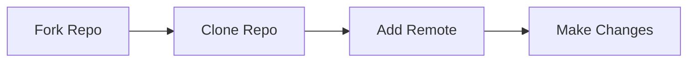
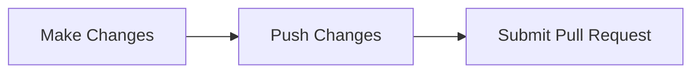
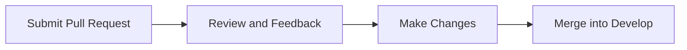
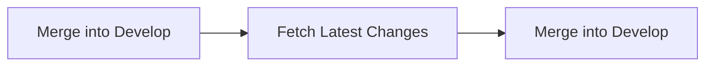

# ft_transcendence

Create a multiplayer online Pong game website using NestJS, TypeScript, and PostgreSQL. The website will feature a user-friendly interface, real-time multiplayer Pong game, and a chat system for players to communicate. Users will be able to login using the OAuth system of 42 intranet, create a unique profile, and play against other players through a matchmaking system. The website must be a single-page application, compatible with the latest stable versions of Google Chrome and one additional web browser, and have no unhandled errors or warnings.

# Rules

- The main branch is considered the production branch and should only contain stable and tested code.

- The develop branch is used for development and testing of new features and changes.

- All pull requests should be made to the develop branch and reviewed by at least one other team member before being merged.

- Once changes on the develop branch have been thoroughly tested and are deemed stable, they can be merged into the main branch.

- Any conflicts or issues encountered during the merge process should be resolved before the merge is completed.

- Regularly merge the main branch into the develop branch to ensure that the develop branch is up to date with the production code.

- All merge should be done by team leader or senior developer.

- Any merge should be done with proper comments and description of the changes.

- Continuous integration and automated testing should be set up to ensure that the code on both branches is always functional and stable.

- Any code that is found to be causing issues or errors should be promptly identified and fixed, and the relevant branches updated accordingly.

# Contributors Guide

## Forking the Repository

- Go to the main repository on GitHub.
- Click on the "Fork" button in the top right corner.
- Select your own GitHub account to fork the repository to.

## Cloning the Repository

- Open your terminal and navigate to the directory where you want to clone the repository.
- Run the following command to clone the repository: `git clone https://github.com/[YOUR_USERNAME]/[REPO_NAME].git`
- Navigate into the cloned repository: `cd [REPO_NAME]`

## Setting Up the Remote

Run the following command to add the main repository as a remote: `git remote add upstream https://github.com/i99dev/ft_transcendence.git`

## Making Changes

- Before making any changes, make sure you are on the develop branch by running `git checkout develop`
- Create a new branch for your changes: `git branch [BRANCH_NAME]`
- Switch to the new branch: `git checkout [BRANCH_NAME]`
- Make your changes and commit them.

## Submitting a Pull Request.

- Push your changes to your forked repository: `git push origin [BRANCH_NAME]`
- Go to the main repository on GitHub and click on the "New pull request" button.
- Select your forked repository and the branch that contains your changes.
- Fill in a detailed description of the changes you made and why they were necessary.
- Submit the pull request for review.

## Review and Merging

- The repository maintainers will review your pull request and provide feedback.
- Make any necessary changes based on the feedback.
- Once your pull request is approved, it will be merged into the develop branch.

## Keeping your Fork Up to Date

- Fetch the latest changes from the main repository: `git fetch upstream`
- Switch to the develop branch: `git checkout develop`
- Merge the latest changes: `git merge upstream/develop`

